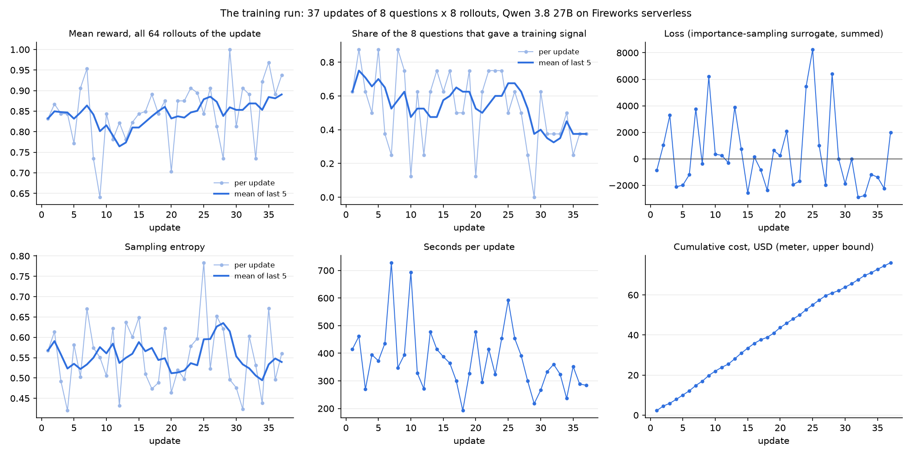
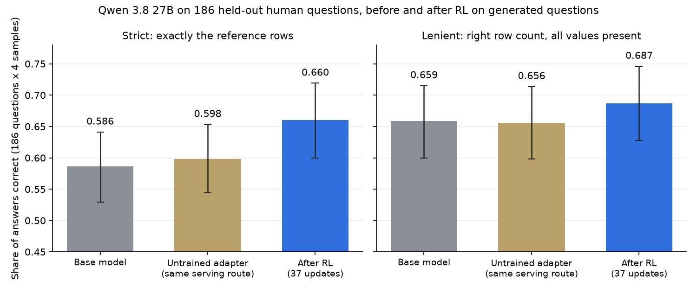
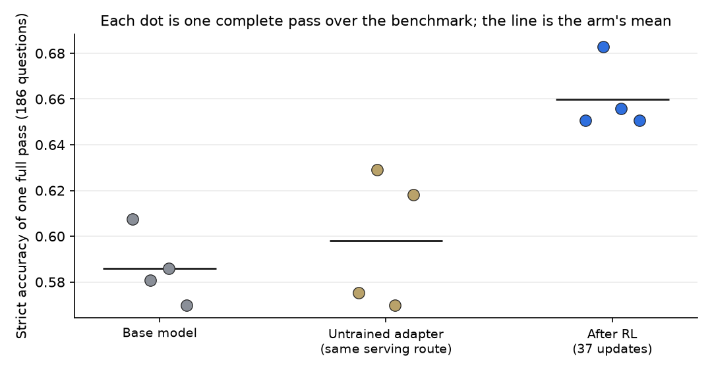
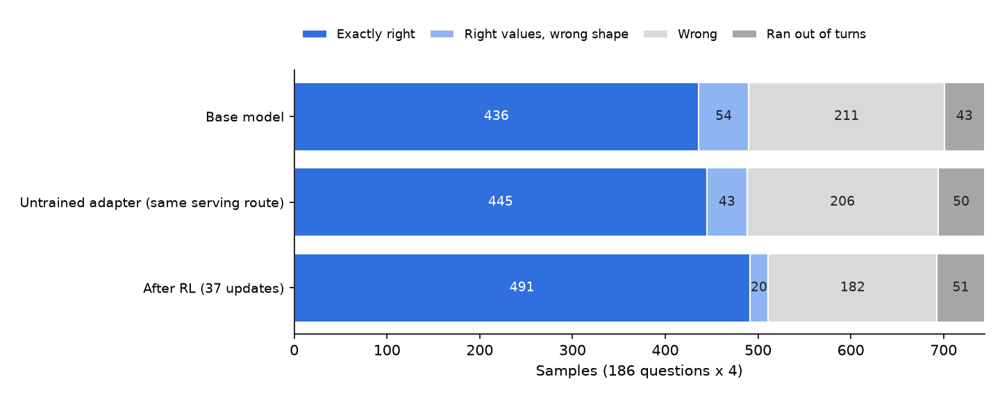
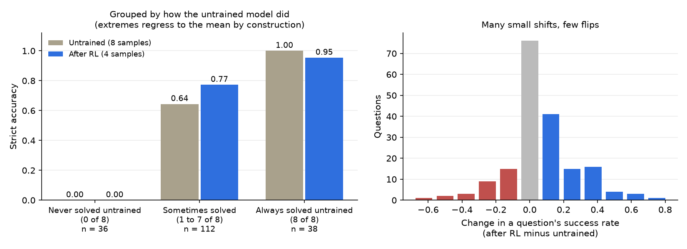
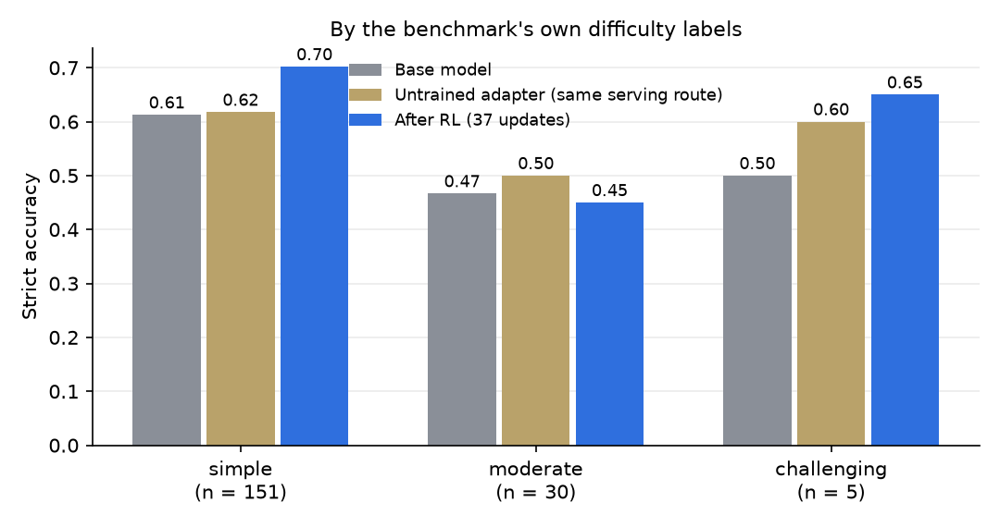

# RL post-training a graph-query agent on Fireworks: a 6-point gain, and what it is made of

*Draft, 2026-10-06. Every number in this post was computed by a script from files on disk;
the sources are listed at the end. Written by Claude (Anthropic) working with Adithya
Giridharan, on training credits provided by Fireworks.*

**In one paragraph.** We took an open model, Qwen 3.8 27B, and trained it with reinforcement
learning to answer questions about a graph database by writing Cypher queries. Training used
only machine-generated questions. We then tested it on 186 human-written questions it had
never seen, from the BIRD benchmark. Strict accuracy rose from 0.598 to 0.660, a gain of 6.2
points (95% interval 3.1 to 9.4), measured against an untrained adapter served the same way.
The gain cleared a bar we fixed before looking. It came from the model getting more reliable
on questions it could already sometimes answer; it did not solve a single question it had
never solved before. The whole experiment ran on Fireworks' serverless training API, with no
GPU to provision, for about $119.

---

## 1. The task

The data is one database from the [BIRD](https://bird-bench.github.io/) text-to-SQL
benchmark: `codebase_community`, a dump of the statistics Stack Exchange site. We re-modelled
it as a property graph in Neo4j: 649,846 nodes (users, posts, comments, votes, post
revisions, tags, badges) and 1,380,394 relationships of 14 types.

The model is an agent. It gets a question, the graph schema, and one tool, `run_cypher`,
which runs a read-only query and returns up to 50 rows. It can call the tool up to 8 times,
look at what comes back, and then give a final answer. We score the **last query that ran
successfully**, by executing it again without the 50-row display limit and comparing the rows
with a reference answer.

Two scorers, both automatic:

- **Strict.** The rows must be exactly the reference rows: same values, same columns, same
  count.
- **Lenient.** The row count must match and every reference value must appear. An answer
  that returns the right number plus an extra column passes lenient and fails strict.

The gap between the two is useful. It separates "found the right thing but returned it in the
wrong shape" from "found the wrong thing". We call the first *form* and the second
*substance*.

**The benchmark.** BIRD supplies 186 human-written questions for this database, with
difficulty labels (151 simple, 30 moderate, 5 challenging). These are evaluation only. No
training question was derived from them, and no rule for generating training questions, with
one declared exception: generated questions carry a hint about as often as the benchmark's
do (172 of 186 there, 284 of 300 in the training file).

**The training data.** 300 generated questions over the same graph, built from 135 query
structures of 0 to 4 hops, each stored with its reference rows. The run used 296 of them
(37 updates of 8). Example:

> *Which 10 tags with stored usage count between 487 and 911 inclusive rank highest by stored
> usage count? Show their names and counts.*

The benchmark questions read differently:

> *List out the dates that users who are located in Rochester, NY obtained their badges?*

So the test is transfer: train on synthetic questions, measure on human ones.

## 2. The training recipe

Standard policy-gradient RL, in the form the Tinker cookbook's `rl/train.py` implements:

1. Take 8 questions. For each, run the agent 8 times at temperature 1.0. That is one *group*
   of 8 rollouts per question, 64 rollouts per update.
2. Reward each rollout: 1.0 if its final query returns exactly the reference rows; otherwise
   the F1 overlap between returned and reference rows, capped at 0.99. In practice the reward was nearly binary:
   of 2,368 training rollouts, 2,004 scored 1.0, 357 scored 0.0 and 7 scored in between.
3. Within each group, subtract the group's mean reward. Rollouts that beat their siblings on
   the same question get a positive weight, the rest a negative one.
4. One gradient step on a LoRA adapter (rank 32), importance-sampling loss, learning rate
   1e-5.

A group where all 8 rollouts get the same reward carries no signal and is dropped. This
matters below.

We ran 37 updates. Settings were fixed in advance and are the same as a
[sibling experiment on a smaller model on another platform](../bird-graph-rl/); this post is about the Fireworks run only.

## 3. Running it on Fireworks

Fireworks' Training API is compatible with the Tinker client: `forward_backward`,
`optim_step`, `save_weights_for_sampler`, `sample`. The training loop, environment and reward
are imported unchanged from the cookbook recipe and checked against pinned file hashes. Only
the service client is swapped, with a shim of about 630 lines.

**What worked as documented.** On the serverless route there is nothing to provision: you
open a session against a shared trainer, train, and sample your latest weights in the same
session. Billing is per token. Log-probabilities come back from `forward_backward`, which the
loop needs. A two-update trial cost $1.62 and ran end to end the first time.

**What the shim had to bridge.**

- The cookbook loop calls `save_weights_and_get_sampling_client`, which Fireworks does not
  offer as one call. The shim does `save_weights_for_sampler` and then opens a sampler on
  the returned path.
- Checkpoint names are limited to 17 characters, and the limit is only enforced when a
  checkpoint is promoted, after training. The shim shortens names up front.
- The loop logs the optimiser's metrics and discards the training call's own, including the
  loss. The shim records them.

**Evaluating a trained adapter.** A serverless adapter can only be sampled inside a live
training session. Once the session closes, the documented route is to promote the checkpoint
and deploy it on dedicated hardware. Saved *training* checkpoints, however, can be loaded
into a fresh session. So the evaluator opens a new session, loads the saved state, saves a
sampler snapshot without training, and samples that. This worked three days after the
training session had closed.

**One wall.** We had planned to train Qwen3.5-9B, to match the sibling experiment. Models
that small train only on dedicated GPUs, and dedicated GPUs need a payment method on the
account even when it holds prepaid credits: the deployment request returned
`payment method is required`, and the docs say accounts without one have 0 training GPUs.
The smallest model on the serverless list is the 27B, so that is the model in this post.

**A lesson about meters.** We wrap every billed call in a cost meter that stops the run at a
dollar limit. Ours prices every prompt token at the uncached rate, so it overstates: in the
trial it read $2.09 against a bill of $1.62, because 53% of prompt tokens were billed at the
cached rate. An upper bound is the safe direction, but we set the stop from it too tightly
and the 37-update run finished with $9 of room.

## 4. The training run



37 updates, 2,368 rollouts, 3.95 million tokens trained, 3.87 hours, with a median of 6
minutes per update. About 93% of each update is sampling, not training.

Three things to read off these curves.

**Half the training set was too easy.** Of 296 question groups, 155 gave a training signal.
134 were dropped because the model answered correctly on all 8 attempts, and 7 because it
failed on all 8. In the first nine updates, before training had done much, the mean reward
was already 0.82. So
the effective training set was about half its nominal size, and we paid to sample the other
half for nothing.

**Reward drifted up, and that is weak evidence.** Mean reward was 0.821 over the first nine
updates and 0.896 over the last nine, and the share of groups giving a signal fell in the
last third. Both are what learning would look like. Both are also what easier questions late
in a shuffled order would look like, and every update sees different questions. We do not
count this as the result.

**The loss is not a learning curve.** It swings between -2,901 and +8,247 and is positive in
17 of 37 updates. With advantages centred inside each group, this loss is a weighted sum of
log-probabilities whose value depends on which rollouts happened to win. It is recorded
because it should be, and it tells you nothing about progress. The curve that carries the
claim is accuracy on questions held out of training.

## 5. The result

We wrote the test down before running it: score only the final checkpoint; four samples per
question; compare paired over the 186 questions with a bootstrap; and call it a success only
if the gain is at least 5 points **and** its 95% interval is above zero.



| 186 questions, four samples each | Base model | Untrained adapter, same route | After RL |
|---|---|---|---|
| Strict | 0.586 | 0.598 | **0.660** |
| Lenient | 0.659 | 0.656 | **0.687** |

- **After RL minus untrained adapter, strict: +0.062** (95% interval +0.031 to +0.094). The
  bar is met.
- Lenient: +0.031 (interval +0.003 to +0.059).
- 56 questions went up, 21 went down.

(The error bars in the figure are for each arm on its own and overlap. The test is paired:
it compares the same question across arms, which removes the large question-to-question
variation. That is why the paired interval is much tighter than the bars suggest.)

**Why there are three arms.** The base model was sampled through the session's base-only
route. The trained adapter was sampled through a loaded checkpoint. Those are different
serving paths, and a difference between them would look exactly like a training effect. So
we evaluated a never-trained adapter through the same path as the trained one. It scored
+0.012 against the base (interval -0.020 to +0.043): no route effect detected, though one of
up to about four points is not excluded. The claim about training is therefore made against
this control, not against the base. Against the base the gain would have read +0.074; we
report the smaller number.



Each dot is a complete pass over the 186 questions. A single pass moves by several points
from sampling alone, which is why one before-and-after pair would not have been enough.

## 6. What the gain is made of



Counting the 744 samples per arm, against the control: exactly-right answers rose by 46
(445 to 491), while "right values, wrong shape" fell by 23 (43 to 20). As net flows, at most
23 of the 46 are form repairs and at least 23 are answers that were wrong under both scorers
before. So roughly half form, half substance. The lenient gain, whose interval sits just
above zero, says the same thing.

**Form: returning what was asked.**

> *How many badges has the user csgillespie obtained?* (reference: `95`)

Untrained, the model wrote a correct query half the time and, the other half, added columns
nobody asked for:

```cypher
MATCH (u:User {displayName: 'csgillespie'})
OPTIONAL MATCH (u)-[:EARNED]->(b:Badge)
RETURN u.userId, u.displayName, count(b) AS badgeCount     -- 8, csgillespie, 95
```

After RL, all four samples returned the count alone:

```cypher
MATCH (u:User {displayName: 'csgillespie'})-[:EARNED]->(b:Badge)
RETURN count(b) AS badgeCount                              -- 95
```

In the evaluation: untrained 4 of 8 strict, 8 of 8 lenient; trained 4 of 4. In four fresh
attempts per model recorded for the viewer below, both got 4 of 4, so this one illustrates a
habit the untrained model has only some of the time.

**Substance: not deduplicating when nobody asked.**

> *List out the dates that users who are located in Rochester, NY obtained their badges?*
> (reference: 38 rows)

The untrained model usually added `DISTINCT`, collapsing badges earned at the same moment and
returning 34 rows. All four control samples did this. It even saw the 38 rows on its first
query and then "cleaned them up":

```cypher
MATCH (u:User)-[e:EARNED]->(b:Badge)
WHERE u.location = 'Rochester, NY'
RETURN DISTINCT e.date AS date ORDER BY date               -- 34 rows, wrong
```

After RL, all four samples left the rows alone:

```cypher
MATCH (u:User {location: 'Rochester, NY'})-[e:EARNED]->(b:Badge)
RETURN e.date AS date ORDER BY date                        -- 38 rows, right
```

In the evaluation: untrained 2 of 8, trained 4 of 4. The fresh recording was less kind: the
trained model got 1 of 4, once adding `DISTINCT` again and twice adding a user-id column. Pooled,
untrained 3 of 12 and trained 5 of 8. The direction holds; the "all four" does not. One
example on four samples is an illustration, not evidence, which is why the claim rests on the
paired test over all 186 questions.

**A regression, for balance.**

> *Which user has a higher reputation, Harlan or Jarrod Dixon?* (reference: `Harlan`)

Untrained, 7 of 8 samples returned the name alone. After RL, 3 of 4 returned more than was
asked (the reputation beside the name, or both users), which fails strict; in the fresh
recording, 4 of 4 did. Pooled: untrained 10 of 12, trained 1 of 8. Training did not uniformly teach "return
less"; on this question it pushed the other way.

## 7. Where it helped and where it did not



This is the finding we did not expect. Pool the two untrained arms, giving 8 samples per
question, and group the questions by how often the untrained model got them right:

- **36 questions it never solved in 8 tries: still never solved.** Zero of 36 were answered
  correctly even once in four tries after training. (Four tries is fewer than eight, so
  staying at zero is easier for the trained arm; but across 36 questions, even a 10% chance
  per try would usually have shown up.)
- **112 questions it sometimes solved: 0.64 to 0.77.**
- **38 questions it always solved: 1.00 to 0.95.** Some decline here is built in, since a
  group picked for being perfect can only stay or fall.

So the 6 points came entirely from making the model more consistent on questions that were
already within its reach. RL on this data did not extend that reach.

"Out of this model's reach" is not "impossible", though. In the sibling experiment, the
smaller Qwen3.5-9B answered 10 of these 36 correctly at least once across its 12 samples per
question, 7 of them before any training. Whatever blocks the 27B on those is not the graph
or the question. The right panel shows
the same thing from the other side: most questions moved by one sample in eight or not at
all, and few flipped outright.



By BIRD's own labels, the gain is on the simple tier (0.62 to 0.70 against the control). The
30 moderate questions did not improve (0.50 control, 0.45 trained). The challenging tier has
5 questions and says nothing.

## 8. What this does not show

- **One training run, one seed.** The interval covers which questions we asked and how the
  samples fell. It does not cover what a second training run would have produced.
- **The control cannot prove the routes equal.** It bounds a route effect at roughly four
  points on strict.
- **No comparison across platforms.** The [sibling experiment](../bird-graph-rl/) used a 9B model. Different
  student, so nothing here says one platform trains better than another.
- **A prediction we got wrong.** Before the result, we predicted the 27B would gain *less*
  than the 9B had (4.6 points on its own platform, ledger row T8), reasoning that the 27B had less
  formatting to fix. It gained 6.2. The interval's lower end is below 4.6, so this does not
  show it gained more; it shows our reasoning for "less" did not hold.
- **The training data was half wasted.** A harder generated set would have given more signal
  per dollar. We did not test that.
- **The base passes are not all from the same week.** One of the four is from 21 September
  and is the highest. It is kept, which works against us.

## 9. Cost

Two kinds of number, kept apart. Fireworks bills per day, not per job, so the bill cannot be
split by component. Our own meter can, but it prices every prompt token at the uncached rate,
so it overstates.

**What was billed:**

| Period | Billed |
|---|---|
| September (first baseline pass and setup) | $3.12 |
| 3 October (trial, training run, eight evaluation passes, tests) | $99.52 |
| 6 October (four control passes) | $16.32 |
| **Total** | **$118.96** |

**Where it went, by our meter (upper bound):**

| Component | Meter |
|---|---|
| Training, 37 updates (21.6M prompt tokens, 3.5M sampled, 4.0M trained) | $76.07 |
| Evaluation, 12 passes of 186 questions ($4.27 a pass, about 13 minutes each) | $51.26 |
| Trial, tests, two abandoned starts | $8.56 |
| **Total** | **$135.89** |

The bill is 87.5% of the meter's total. The difference is prompt caching: an agent re-sends
its growing conversation every turn, and about half of those prompt tokens were billed at the
cached rate.

The $118.96 came out of $150 of credit. No hourly resource was ever running, so nothing could
be left on by mistake. The one time we did request dedicated hardware, the request was refused
and an independent watchdog deleted the queued trainer job within a minute.

## 10. What we would do next

1. **Train on questions the model gets wrong half the time.** Selecting generated questions
   by the base model's own pass rate would roughly double the signal per dollar, and is the
   direct test of whether harder data extends reach rather than only reliability.
2. **A second seed.** The cheapest way to learn how much of 6.2 points is this run.
3. **The never-solved 36.** Read them, starting with the 10 a smaller model sometimes gets.
   If the rest need query shapes the generator never produces, that is a data problem with a
   concrete fix.

## Sources

Code, journal and ledger: the `bird_graph_rl` example on the `bird-graph-rl` branch of
[IamAGP/cookbook](https://github.com/IamAGP/cookbook), a fork of `fw-ai/cookbook`.

| Claim | File |
|---|---|
| Accuracy, intervals, outcomes, route control | `fw_e3_check.py` → `fw_e3_check.json` |
| Figures and their values | `blog/make_figures.py` → `blog/figures/numbers.json` |
| Training run | `fw_rl_27b_run1b/curves.csv`, `fireworks_meta.json` |
| Pre-registrations, preflights, every billed action | `JOURNAL.md` (entries FW-T1 to FW-E3) |
| One row per quoted fact | `SHARED_LEDGER.md`, rows W12 to W23 |

The benchmark is BIRD (CC BY-SA 4.0); the underlying content is Stack Exchange user content.
